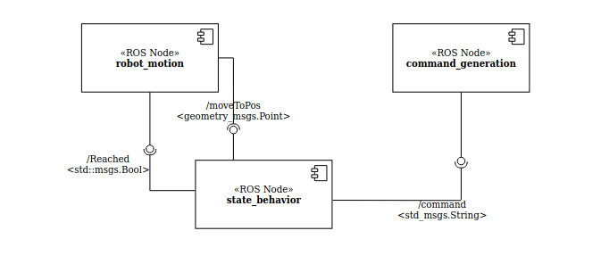

# Experimental Robotics Assignment 1

November 13, 2020

## Index

* [Introduction](#S-Introduction)
* [Software Architecture](#S-Sofar)
* [Packages and Files List](#S-PFL)
* [Installation and Running Procedure](#S-IRP)
* [Working Hypothesis](#S-WH)
* [System’s Features](#S-SF)
* [System’s Limitations and Possible Technical Improvements](#S-SL)
* [Authors and Contacts](#S-AC)

# Introduction
The aim of this assignment is to implement three states of the robot which are Normal, Play and Sleep. We use smach_viewer in ROS to implement these behaviors and visualize the states.

# Software Architecture
## The State Machine Diagram
For implementing the concept, we can see the finite state machine diagram in the image below. Here, there are three states of the robot. The transitions are mentioned in the image.

* Normal - This state has two possible transitions "go_sleep" and "start_play"
* Play - This state has one outcome where it goes back to the normal state with transition "go_to_normal"
* Sleep - This state also has one tansition where it goes to normal state with "wake_up"
## Component Diagram
The following figure illustrates how it has been implemented. There are theree ROS nodes. The node *command_genration* publishes the string rostopic */command* which is subscribes by the *state_behavior*. Similarly, the robot motion publishes boolean rostopic */Reached* which is then subscribed by *state_behavior*. Lastly, *geometry_messages/Point* message is published by *state_behavior* and subcribed by *robot_motion*.

### The Messages 
This package has some messages which are described in the following.
* geometry_messages/Point - It is used for the x,y coordinate of the robot.
* std_msgs/Bool - To check if the robot has reached the position or not.
* std_msgs/String - To receive the command from person to play with the robot.
### The Parameters
The following parameters are launched from the launch file. These can be altered using the launch file in robot_motion/launch/behaviors.launch thus allowing flexibility.
* world_width and world_height: These are used for setting the 2D environment.
* home_x and home_y: These define the SLEEP coordinates of the behavior. The robot goes to this position when it is tired.
* fast: These parameter is used to travel faster while navigating between two points in the environment.
* tireness_level: This defines the threshold of the robot when it is under any state. 

# Packages and Files List

There are two packages in python, which are *command_generation.py* and *state_behavior.py* under finite_state_machine/src folder.
There is one C++ file whihc is *random_motion.cpp* under robot_motion/src folder.

The doc folder contains the doxygen file as well as the index.html file which can be used to see the documentation in the browser.

# Installation and Running Procedure
Firstly, the repository should be cloned into the ROS workspace with the command

    git clone https://github.com/RohitK14/Assignment1_ExperimentalRobotics.git
    
As the state machine is implemented using smach_viewer, we need to install it, if it is not available.

    sudo apt-get install ros-<melodic>-smach-viewer

where <meldoc> is the ROS distribution in the system. 

Now, we need to build the workspace. It can be done using catkin build command. In the workspace, use catkin build

    catkin build

The python scripts are not executable. Hence, go to finite_state_machine/src folder and run the following command to make it executatble,

    chmod +x state_behavior.py
    chmod +x command_generation.py

To run the application, we can run it using the launch file,

    roslaunch robot_motion behaviors.launch

To switch the state to play, the user gives the command "play" using the follwing command

    rostopic pub /command std_msgs/String play

In order to generate the documentation, there is a Doxyfile in the doc folder. To see the documentation we run,

    doxygen Doxyfile && firefox html/index.html 

# Working Hypothesis and Environment
The hypothesis that is considered here is that the robot starts in the NORMAL state. When the robot is randomly moving in the 2D environment, it gets tired. We have a parameter that decided the tireness level. If the level is 5, the robot reaches 5 positions and goes to SLEEP state. The sleep state is considered to be at origin which can be changed using the parameters. The robot sleeps for 10 seconds as per our hypothesis.
The robot goes between these two states unless there the user publish "play" command. Whenever, we receive play command, the robot finishes it's last motion and goes to the person. The person position is generated randomly whenever we revceive "play" command. It is confirmed that the robot reahces the person and waits for the gesture coordinates. The gesture coordinates are random and the robot goes to position and comes back to the person. This is repeated until the robot does this to and fro motion before crossing the tired level. The robot is not expected to get tired in between and go to sleep position. The only possible state for the transition is normal state before going to sleep state. 

# System’s features
* The 2D environment which can be changed by the user.
* All states and information available on the terminal where we launch the file.
* The publisher command has to be given from another terminal.
* smach_viewer for visualising the states.
* Play command can be send any time between the states.

# System’s limitations and Possible Technical Improvements
* The command has to be given from another terminal.
* No gazebo or RViz visualization for better understanding.
* There is a possibilty that the robot can go to sleep while playing when it is tired.
* The person does not give the gesture command, although in our case we force to generate random gesture commands
* No odometry control, the time to reach between the points is roughly caclulated.

The main aim of the assignment is to implement the architecture of the required behavior. Although, we can resolve the above limmitations to improve it. 

# Authors and Contacts
This project was relized by Rohit Kumar

University email s5089482@studenti.unige.it
gmail: rohitkb114@gmail.com
